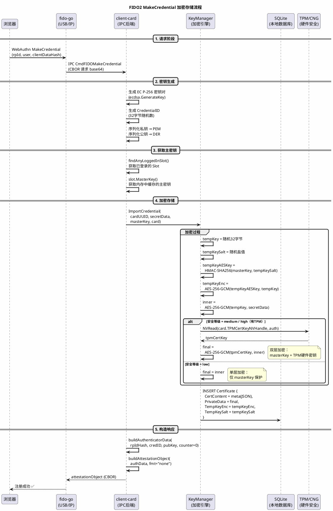
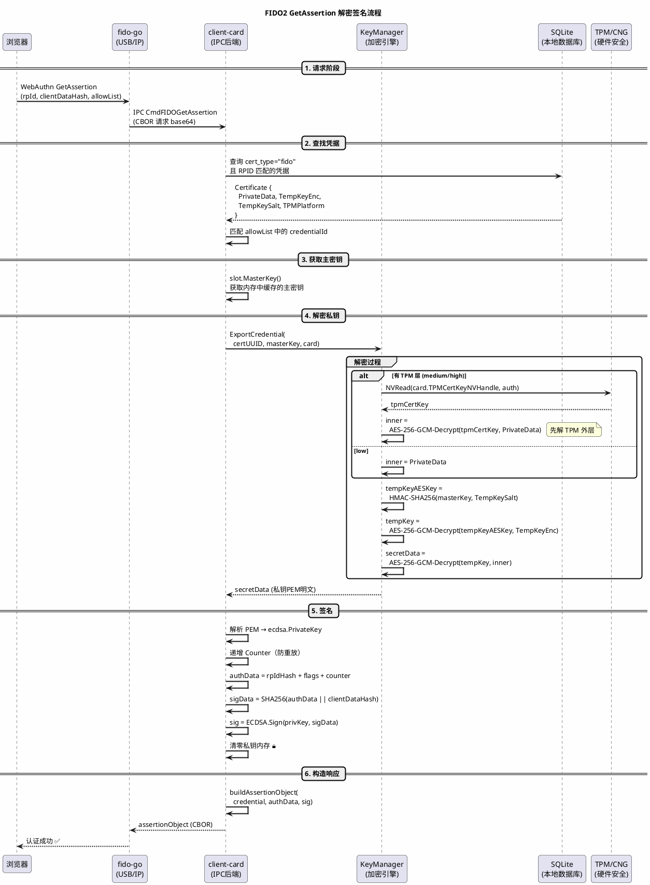
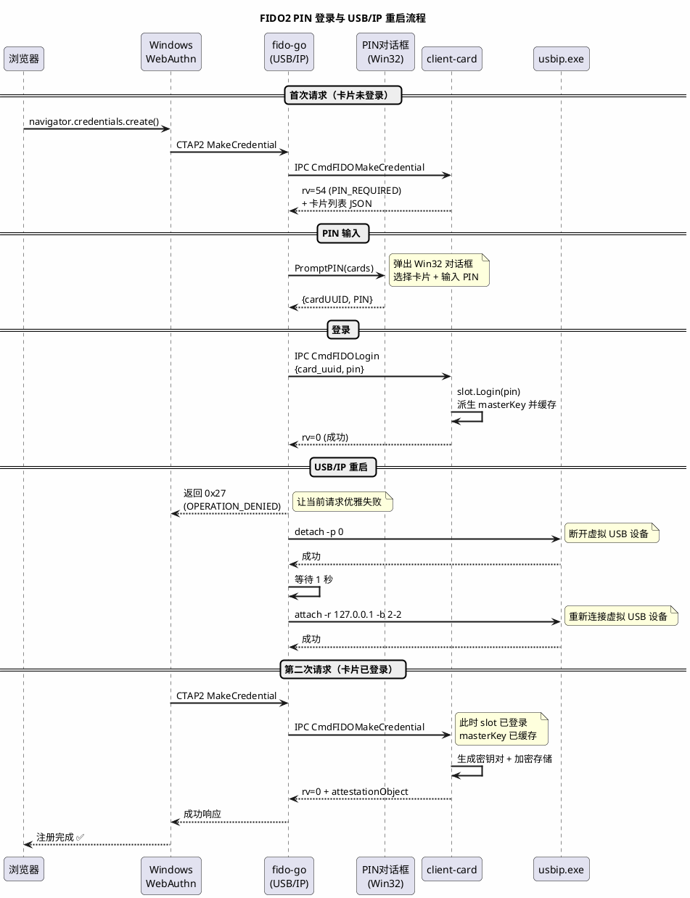

# FIDO2 凭据加密存储流程

## 概述

OpenCert FIDO2 凭据存储在本地 SQLite 数据库中，复用 `storage.Certificate` 表（`cert_type = "fido"`）。
每条凭据关联到一张虚拟智能卡（通过 `card_uuid`），私钥通过多层加密保护。

## 存储结构

| 字段 | 内容 | 是否加密 |
|------|------|----------|
| `CertContent` | 公开元数据（RPID、用户名、CredentialID、Counter 等） | ❌ 明文 JSON |
| `PrivateData` | 私密数据（ECDSA 私钥 PEM、公钥 DER、AAGUID） | ✅ AES-256-GCM |
| `TempKeyEnc` | 加密后的临时密钥 | ✅ |
| `TempKeySalt` | 临时密钥加密盐值 | 明文 |

## 数据流架构

```
浏览器 WebAuthn
  → Windows webauthn.dll
  → USB/IP 虚拟 HID（fido-go 进程）
  → IPC Named Pipe
  → client-card Go 后端
  → fido.Store（SQLite + 加密层）
```

## 加密流程（MakeCredential）



## 解密流程（GetAssertion）



## 三级安全等级对比

```
┌─────────────────────────────────────────────────────────────────────────┐
│ 安全等级 │ 加密层数 │ 密钥保护方式                                       │
├─────────────────────────────────────────────────────────────────────────┤
│ Low      │ 1 层     │ masterKey → HMAC → tempKey → AES-GCM(私钥)        │
│          │          │ 仅软件保护，PIN 正确即可解密                        │
├─────────────────────────────────────────────────────────────────────────┤
│ Medium   │ 2 层     │ 内层：masterKey → tempKey → AES-GCM(私钥)          │
│          │          │ 外层：TPM NV 中的 tpmCertKey → AES-GCM(内层密文)   │
│          │          │ 即使数据库被拷贝，没有 TPM 硬件也无法解密           │
├─────────────────────────────────────────────────────────────────────────┤
│ High     │ 2 层     │ 同 medium（若 TPM 可用）                            │
│          │          │ TPM 不可用时退化为 low                              │
└─────────────────────────────────────────────────────────────────────────┘
```

## PIN 登录与 USB/IP 重启流程



## 关键安全设计

1. **masterKey 来源**：用户输入 PIN → `slot.Login()` → 从卡片加密密钥派生 → 缓存在进程内存中（登录期间有效）

2. **间接加密（tempKey）**：私钥不直接用 masterKey 加密，而是：
   - 生成随机 `tempKey`（32字节）
   - 用 `HMAC-SHA256(masterKey, salt)` 派生 AES 密钥加密 `tempKey`
   - 用 `tempKey` 加密实际私钥数据
   - 好处：即使 masterKey 泄露，没有对应的 salt 也无法解密

3. **TPM 双层保护**（medium/high）：
   - 内层用 masterKey 加密
   - 外层用 TPM 硬件中存储的密钥再加密
   - 即使数据库文件被拷贝到另一台电脑，没有 TPM 硬件也无法解密

4. **内存安全**：
   - 所有密钥使用后立即 `zeroBytes()` 清零
   - 使用 `defer` 确保异常时也能清零
   - PIN 输入框内容在读取后立即清除

5. **防重放**：
   - 每次 GetAssertion 签名后递增 Counter
   - 服务端验证 Counter 单调递增，防止重放攻击

## 文件位置

| 组件 | 路径 |
|------|------|
| FIDO Store（存储层） | `clients/internal/fido/store.go` |
| KeyManager（加密引擎） | `clients/internal/card/local/keymgr.go` |
| MakeCredential 处理 | `clients/internal/ipc/handler_fido.go` |
| GetAssertion 处理 | `clients/internal/ipc/handler_fido.go` |
| IPC CTAP 代理 | `drivers/codes/fido-go/internal/client/opencert_client.go` |
| PIN 对话框 | `drivers/codes/fido-go/internal/client/pin_dialog_windows.go` |
| USB/IP 主程序 | `drivers/codes/fido-go/cmd/fido-go/main.go` |
