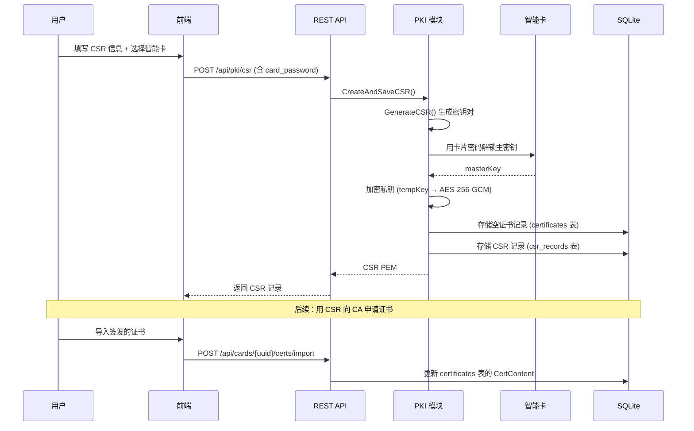
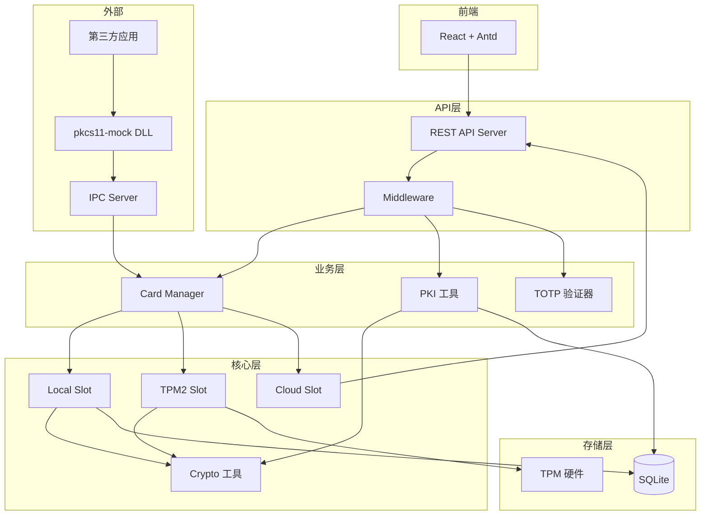

# OpenCert Manager — 文档目录与项目结构

> 项目名称：OpenCert Manager  
> 文档版本：v2.1.0  
> 最后更新：2026-05-26

---

## 📑 文档目录

| # | 文档 | 文件名 | 内容概要 |
|---|------|--------|----------|
| 00 | **需求文档** | `00-REQUIRE.MD` | 原始需求描述、功能清单 |
| 01 | **项目总览** | `01-OVERVIEW.MD` | 项目定位、系统全景、技术栈、设计原则 |
| 02 | **架构设计** | `02-ARCHITECTURE.MD` | 系统架构、组件交互、IPC 协议、数据流 |
| 03 | **云端平台** | `03-CLOUD-PLATFORM.MD` | server-card 全部功能详细设计 |
| 04 | **本地管理端** | `04-LOCAL-MANAGER.MD` | client-card 功能设计、前端页面规划 |
| 05 | **PKCS#11 驱动** | `05-PKCS11-DRIVER.MD` | pkcs11-mock 驱动设计与功能映射 |
| 06 | **安全设计** | `06-SECURITY.MD` | 加密方案、威胁模型、安全策略 |
| 07 | **API 规范** | `07-API.MD` | 完整 REST API 接口规范 |
| 08 | **前端设计** | `08-FRONTEND.MD` | 前端架构、页面规划、侧边栏菜单 |
| 09 | **数据库设计** | `09-DATABASE.MD` | 数据模型、表结构、索引设计 |
| 10 | **部署运维** | `10-DEPLOY.MD` | 构建、配置、部署、运维指南 |
| 11 | **开发路线图** | `11-ROADMAP.MD` | 分阶段计划、里程碑、待办事项 |
| 12 | **修复建议** | `12-FIX-SUGGESTIONS.MD` | 代码审查发现的问题与修复建议 |
| 13 | **修复路线图** | `13-FIX-ROADMAP.MD` | 修复计划与优先级排序 |
| 14 | **审计报告** | `14-AUDIT-REPORT.md` | 安全审计报告 |
| 15 | **变更日志 R4** | `15-CHANGELOG-ROUND4.md` | 第四轮开发变更记录 |

### 附录

| 文档 | 文件名 | 内容 |
|------|--------|------|
| 评估报告 R3 | `02-EVALUATION-ROUND3.md` | 第三轮评估报告 |
| 任务清单 R3 | `03-TASKS-ROUND3.md` | 第三轮任务清单 |
| 变更日志 R3 | `04-CHANGELOG-ROUND3.md` | 第三轮变更记录 |
| CA 参考资料 | `ca/` | DN 字段、EKU、OID 参考 |

---

## 🏗️ 项目整体结构

```
PKCS11Driver/
├── clients/                          # 本地管理端 (client-card)
│   ├── cmd/
│   │   └── client-card/
│   │       └── main.go              # 程序入口
│   ├── configs/
│   │   ├── config.go                # 配置加载逻辑
│   │   └── config.yaml              # 默认配置文件
│   ├── internal/
│   │   ├── api/                     # REST API 层
│   │   │   ├── server.go            # HTTP 服务器、路由注册
│   │   │   ├── middleware/          # 中间件（认证、限流、指标）
│   │   │   ├── cert_handler.go      # 智能卡证书管理 API
│   │   │   ├── credential_handler.go # 安全凭据管理 API
│   │   │   ├── pki_handler.go       # PKI 工具 API（CSR/CA/签发）
│   │   │   ├── cloud_deliver_util.go # 云端证书下发工具
│   │   │   └── helpers.go           # 通用辅助函数
│   │   ├── card/                    # 智能卡核心逻辑
│   │   │   ├── manager.go           # Slot 管理器
│   │   │   ├── slot.go              # SlotProvider 接口定义
│   │   │   ├── local/               # 本地 Slot 实现
│   │   │   │   ├── slot.go          # Local Slot（SQLite + AES256）
│   │   │   │   ├── keymgr.go        # 密钥管理（生成/加密/存储）
│   │   │   │   ├── certutil.go      # 证书解析工具
│   │   │   │   └── export.go        # 智能卡导出/恢复（.ocs 格式）
│   │   │   └── tpm2/                # TPM2 Slot 实现
│   │   │       ├── slot.go          # TPM2 Slot
│   │   │       └── keymgr.go        # TPM 密钥管理
│   │   ├── crypto/                  # 加密工具库
│   │   │   ├── aes.go              # AES-256-GCM 加解密
│   │   │   ├── hmac.go             # HMAC-SHA256 密钥派生
│   │   │   ├── argon2.go           # Argon2id 密钥派生
│   │   │   └── bcrypt.go           # 密码哈希
│   │   ├── ipc/                     # IPC 通信层
│   │   │   ├── server.go           # Named Pipe / Unix Socket 服务端
│   │   │   ├── handler_*.go        # IPC 消息处理器
│   │   │   └── protocol.go         # IPC 协议定义
│   │   ├── pki/                     # PKI 工具
│   │   │   ├── cert.go             # CSR/证书生成与签发
│   │   │   ├── csr.go              # CSR 生成核心逻辑
│   │   │   ├── convert.go          # 格式转换（PEM/DER/PKCS12）
│   │   │   └── selfsign.go         # 自签名证书
│   │   ├── storage/                 # 数据存储层
│   │   │   ├── db.go               # SQLite 数据库初始化
│   │   │   ├── models.go           # 数据模型定义
│   │   │   ├── repo.go             # 用户/卡片仓库
│   │   │   ├── cert_repo.go        # 证书仓库
│   │   │   └── pki_repo.go         # PKI 仓库（CSR/CA/PKICert）
│   │   ├── totp/                    # TOTP 验证器
│   │   │   └── store.go            # TOTP 存储与验证
│   │   ├── tpm/                     # TPM 抽象层
│   │   ├── tray/                    # 系统托盘
│   │   └── ui/                      # UI 嵌入
│   ├── pkg/
│   │   └── pkcs11types/             # PKCS#11 类型定义
│   ├── front/                       # 前端（React + TypeScript）
│   │   ├── src/
│   │   │   ├── api/                 # API 调用封装
│   │   │   ├── pages/               # 页面组件
│   │   │   │   ├── Cards/           # 智能卡管理
│   │   │   │   ├── Certs/           # 用户证书管理
│   │   │   │   ├── Credentials/     # 安全凭据管理
│   │   │   │   ├── PKI/             # PKI 工具（CSR/CA/签发）
│   │   │   │   ├── Users/           # 用户管理
│   │   │   │   ├── Logs/            # 日志查看
│   │   │   │   └── Settings/        # 系统设置
│   │   │   ├── layouts/             # 布局组件
│   │   │   ├── store/               # Zustand 状态管理
│   │   │   ├── locales/             # 国际化（中/英）
│   │   │   └── types/               # TypeScript 类型定义
│   │   ├── electron/                # Electron 桌面端
│   │   └── vite.config.ts           # Vite 构建配置
│   ├── test/                        # 测试文件
│   │   ├── api_test.go              # API 集成测试
│   │   ├── crypto_test.go           # 加密模块测试
│   │   ├── ipc_test.go             # IPC 通信测试
│   │   ├── local_slot_test.go       # Local Slot 测试
│   │   ├── tpm2_slot_test.go        # TPM2 Slot 测试
│   │   └── e2e_*.go                 # 端到端测试
│   └── ui/
│       └── embed.go                 # 前端静态资源嵌入
│
├── servers/                          # 云端平台 (server-card)
│   ├── cmd/
│   │   └── server-card/
│   │       └── main.go              # 程序入口
│   ├── internal/
│   │   ├── api/                     # REST API 层
│   │   ├── ca/                      # CA 管理服务
│   │   ├── storage/                 # PostgreSQL 存储
│   │   ├── template/                # 证书模板引擎
│   │   ├── acme/                    # ACME 协议实现
│   │   ├── ocsp/                    # OCSP 响应服务
│   │   └── ct/                      # CT 日志服务
│   └── configs/
│
├── pkcs11-mock/                      # PKCS#11 驱动 (C 语言)
│   ├── src/
│   │   ├── pkcs11_mock.c           # 主实现文件
│   │   ├── ipc_client.c            # IPC 客户端
│   │   └── pkcs11_mock.h           # 头文件
│   ├── include/
│   │   └── pkcs11/                  # PKCS#11 标准头文件
│   └── CMakeLists.txt               # CMake 构建配置
│
└── roadmap/                          # 项目文档
    ├── 00-INDEX.MD                   # 本文档（目录与结构）
    ├── 00-REQUIRE.MD                 # 需求文档
    ├── 01-OVERVIEW.MD                # 项目总览
    ├── 02-ARCHITECTURE.MD            # 架构设计
    ├── ...                           # 其他文档
    └── ca/                           # CA 参考资料
        ├── dn.txt                    # DN 字段参考
        ├── eku.txt                   # EKU 参考
        └── oids.txt                  # OID 参考
```

---

## 🔐 安全架构概览

### 密钥层级

```
┌─────────────────────────────────────────────────────────┐
│                    用户密码 (PIN/PUK/AdminKey)            │
│                           │                              │
│                    HMAC-SHA256 + Salt                     │
│                           │                              │
│                    ▼ 解密 ▼                              │
│              ┌─────────────────┐                         │
│              │   卡片主密钥     │  (32 字节随机)           │
│              └────────┬────────┘                         │
│                       │                                  │
│              HMAC-SHA256 + Salt                           │
│                       │                                  │
│                ▼ 解密 ▼                                  │
│         ┌──────────────────┐                             │
│         │    临时密钥       │  (32 字节随机, 每证书独立)   │
│         └───────┬──────────┘                             │
│                 │                                        │
│          AES-256-GCM                                     │
│                 │                                        │
│          ▼ 解密 ▼                                       │
│    ┌────────────────────┐                                │
│    │   证书私钥 (DER)    │                               │
│    └────────────────────┘                                │
└─────────────────────────────────────────────────────────┘
```

### 三级安全模式

| 安全等级 | 密钥存储 | 导出能力 | 适用场景 |
|---------|---------|---------|---------|
| **高 (high)** | TPM 硬件 + 主密钥加密 | ❌ 不可导出 | 企业核心证书 |
| **中 (medium)** | TPM 证书密钥加密 + 主密钥加密 | ⚠️ AdminKey 可导出 | 团队共享证书 |
| **低 (low)** | 仅主密钥加密 | ✅ PIN 可导出 | 个人证书 |

---

## 🔄 核心数据流

### CSR 生成 → 证书签发 → 智能卡存储



---

## 📦 模块依赖关系



---

## 🚀 快速开始

### 构建与运行

```bash
# 1. 构建前端
cd clients/front && npm install && npm run build

# 2. 构建后端
cd clients && go build -o client-card ./cmd/client-card

# 3. 运行
./client-card
# 默认监听 http://localhost:1026
```

### 开发模式

```bash
# 前端热更新
cd clients/front && npm run dev

# 后端（需要 Go 1.22+）
cd clients && go run ./cmd/client-card --dev
```

---

## 📋 阅读建议

1. **新手入门**：先读 `01-OVERVIEW.MD` 了解全貌，再读 `02-ARCHITECTURE.MD` 理解架构
2. **前端开发**：`08-FRONTEND.MD` → `07-API.MD`
3. **后端开发**：`02-ARCHITECTURE.MD` → `06-SECURITY.MD` → `09-DATABASE.MD`
4. **安全审计**：`06-SECURITY.MD` → `14-AUDIT-REPORT.md`
5. **部署运维**：`10-DEPLOY.MD`
6. **了解进度**：`11-ROADMAP.MD` → `15-CHANGELOG-ROUND4.md`
