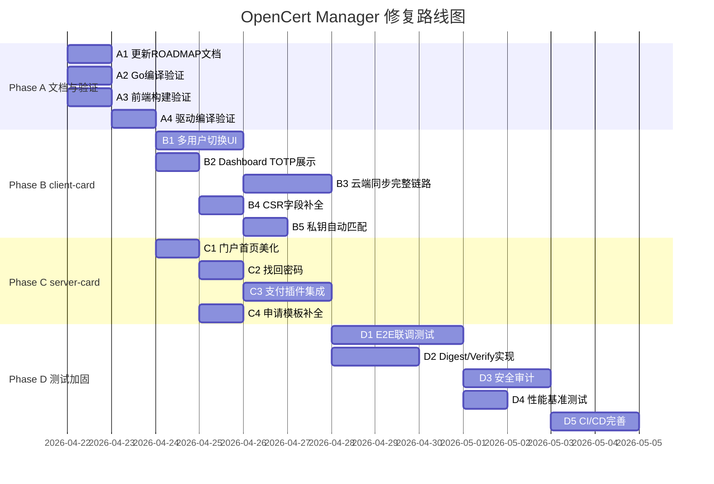

# OpenCert Manager 修复路线图

> 创建日期：2026-04-21
> 预估总工期：3-4 周

---

## 一、阶段进度概览

```
当前状态 (~85%)                              目标状态 (~95%+)
┌────────────────────────────────┐          ┌────────────────────────────────┐
│ server-card  ████████░░ 92%   │          │ server-card  █████████░ 97%   │
│ client-card  ██████░░░░ 78%   │   ──→    │ client-card  █████████░ 93%   │
│ pkcs11-mock  █████████░ 90%   │          │ pkcs11-mock  █████████░ 93%   │
│ E2E 测试     ██░░░░░░░░ 20%   │          │ E2E 测试     ████████░░ 80%   │
│ 文档同步     ██████░░░░ 60%   │          │ 文档同步     █████████░ 95%   │
└────────────────────────────────┘          └────────────────────────────────┘
```

---

## 二、修复路线甘特图

```
Phase A: 文档同步与质量验证 (1-2天)
═══════════════════════════════════════════════════════════════════════════
Week 1 Day 1-2
├── A1 [P0] 更新 11-ROADMAP.MD，与 CHANGELOG 对齐    ████
├── A2 [P0] go build/vet 三组件全量编译验证            ████
├── A3 [P0] npm run build 两个前端项目构建验证         ████
└── A4 [P1] CMake 三平台驱动编译验证                   ████

Phase B: client-card 多用户与云端同步完善 (1周)
═══════════════════════════════════════════════════════════════════════════
Week 1 Day 3 ~ Week 2 Day 2
├── B1 [P0] 多用户切换 UI                             ████████
│   ├── 右上角用户切换下拉
│   ├── 已登录用户列表
│   └── 新增用户入口
├── B2 [P0] Dashboard 多用户 TOTP 展示                ████
│   ├── 卡片/表格双视图
│   ├── 翻页功能
│   └── 复制验证码
├── B3 [P0] 云端同步完整链路                           ████████
│   ├── 自动定时同步
│   ├── 手动刷新
│   ├── 增量同步
│   └── pkcs11-mock 注册
├── B4 [P1] CSR 生成字段补全                           ████
│   ├── 对齐 dn.txt 25 个字段
│   └── 完整 SAN/EKU 选择
└── B5 [P1] 证书导入私钥自动匹配                       ██
    └── 公钥指纹 SHA-256 比对

Phase C: server-card 功能收尾 (3-5天)
═══════════════════════════════════════════════════════════════════════════
Week 2 Day 3 ~ Week 3 Day 2
├── C1 [P1] 门户首页美化                              ████
│   ├── Hero 区域
│   ├── 功能卡片
│   ├── 安全特性展示
│   └── 技术规格
├── C2 [P1] 找回密码 API + 前端                       ████
│   └── 邮箱验证码重置密码流程
├── C3 [P2] 支付插件实际集成                           ██████
│   └── 至少一个支付渠道 (Stripe/手动充值)
├── C4 [P1] 证书申请模板前端字段补全                    ██
└── C5 [P3] ACME TLS-ALPN-01 验证 (可选)              ████

Phase D: 集成测试与安全加固 (1-2周)
═══════════════════════════════════════════════════════════════════════════
Week 3 Day 3 ~ Week 4+
├── D1 [P0] E2E 联调测试                              ████████████
│   ├── pkcs11-mock → client-card 链路
│   ├── client-card → server-card 链路
│   └── 完整三组件端到端测试
├── D2 [P2] pkcs11-mock Digest/Verify 实现             ████████
├── D3 [P1] 安全审计                                   ████████
│   ├── API 输入验证覆盖率
│   ├── SQL 注入防护
│   └── XSS 防护
├── D4 [P2] 性能基准测试                               ████
│   ├── 签名/解密延迟
│   ├── API 吞吐量
│   └── IPC 通信延迟
└── D5 [P1] CI/CD 完善                                ████████
    ├── 三平台矩阵构建
    ├── 自动化测试
    └── 安全扫描
```

---

## 三、时间线视图

```
        Week 1          Week 2          Week 3          Week 4
Day:  1  2  3  4  5   1  2  3  4  5   1  2  3  4  5   1  2  3  4  5
      ─────────────   ─────────────   ─────────────   ─────────────

A1    ██                                                              文档同步
A2    ██                                                              编译验证
A3    ██                                                              前端构建
A4       ██                                                           驱动编译

B1          ████████                                                  多用户UI
B2          ████                                                      TOTP展示
B3                ████████                                            云端同步
B4                      ████                                          CSR补全
B5                         ██                                         私钥匹配

C1                            ████                                    门户首页
C2                               ████                                 找回密码
C3                                  ██████                            支付集成
C4                            ██                                      模板补全

D1                                        ████████████                E2E测试
D2                                              ████████              Digest实现
D3                                                    ████████        安全审计
D4                                                          ████      性能测试
D5                                                       ████████     CI/CD
```

---

## 四、依赖关系图

```
                    ┌─────────┐
                    │ Phase A │  文档同步与质量验证
                    │ (1-2d)  │
                    └────┬────┘
                         │
              ┌──────────┼──────────┐
              │          │          │
              ▼          ▼          ▼
        ┌─────────┐ ┌─────────┐ ┌─────────┐
        │ Phase B │ │ Phase C │ │   D2    │
        │ (1 wk)  │ │ (3-5d)  │ │ (2d)   │
        │client改 │ │server改 │ │Digest  │
        └────┬────┘ └────┬────┘ └────┬────┘
             │           │           │
             └─────┬─────┘           │
                   │                 │
                   ▼                 │
             ┌─────────┐            │
             │   D1    │ ◄──────────┘
             │ E2E测试  │
             │ (3d)    │
             └────┬────┘
                  │
           ┌──────┼──────┐
           │      │      │
           ▼      ▼      ▼
        ┌─────┐┌─────┐┌─────┐
        │ D3  ││ D4  ││ D5  │
        │安全 ││性能 ││CI/CD│
        │审计 ││测试 ││完善 │
        └─────┘└─────┘└─────┘
```

---

## 五、优先级矩阵

```
                        影响范围
                 低          中          高
            ┌──────────┬──────────┬──────────┐
        高  │          │ S5 找回  │ C1 多用户│
  紧        │          │ 密码     │ C2 云同步│
  急        │          │          │ D1 E2E   │
  程        ├──────────┼──────────┼──────────┤
  度    中  │ S4 ALPN  │ S1 首页  │ B2 TOTP  │
            │ C7 FIDO  │ S2 模板  │ B4 CSR   │
            │          │ S6 定价  │ D3 安全  │
            ├──────────┼──────────┼──────────┤
        低  │ D4 性能  │ D2 Digest│ D5 CI/CD │
            │          │ D4 跨平台│          │
            └──────────┴──────────┴──────────┘

图例：
  P0 = 高紧急 + 高影响 (必须立即修复)
  P1 = 中紧急 + 中/高影响 (本轮必须完成)
  P2 = 低紧急 + 中影响 (建议完成)
  P3 = 低紧急 + 低影响 (可选)
```

---

## 六、Mermaid 甘特图（可在支持 Mermaid 的工具中渲染）



---

## 七、里程碑检查点

| 里程碑 | 预计日期 | 验收标准 |
|--------|:--------:|---------|
| **M1** 编译通过 | Week 1 Day 2 | 三组件 + 两前端全部编译通过，文档已同步 |
| **M2** client-card 功能完善 | Week 2 Day 2 | 多用户切换、TOTP 展示、云端同步可演示 |
| **M3** server-card 功能收尾 | Week 3 Day 2 | 门户首页、找回密码、支付集成可演示 |
| **M4** E2E 测试通过 | Week 3 Day 5 | 三组件联调测试覆盖核心链路 |
| **M5** 安全加固完成 | Week 4 Day 3 | 安全审计报告 + CI/CD 流水线就绪 |
| **M6** 发布就绪 | Week 4 Day 5 | 所有 P0/P1 任务完成，覆盖率 ≥ 95% |
