# OpenCert Manager — 加密解密流程图方案

> 文档版本：v1.0.0
> 最后更新：2026-05-26
> 基于代码：`clients/internal/card/local/keymgr.go`、`clients/internal/card/local/slot.go`、`clients/internal/card/tpm2/`、`clients/internal/crypto/`

---

## 一、密钥体系总览

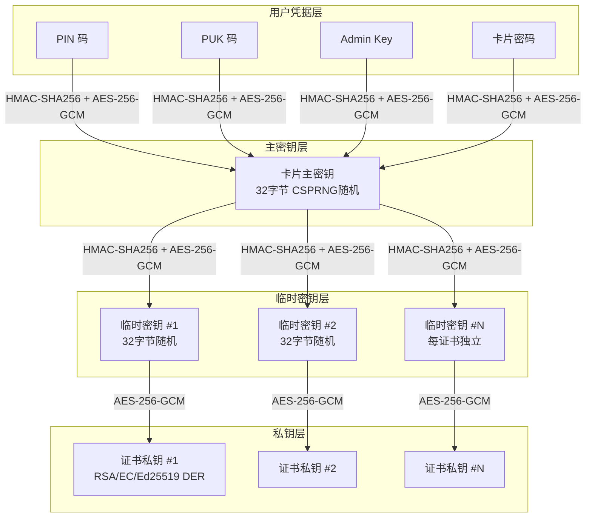
```mermaid
graph TB
    subgraph 用户凭据层
        PIN[PIN 码]
        PUK[PUK 码]
        ADMIN[Admin Key]
        CARD_PWD[卡片密码]
    end

    subgraph 主密钥层
        MK[卡片主密钥<br/>32字节 CSPRNG随机]
    end

    subgraph 临时密钥层
        TK1[临时密钥 #1<br/>32字节随机]
        TK2[临时密钥 #2<br/>32字节随机]
        TKn[临时密钥 #N<br/>每证书独立]
    end

    subgraph 私钥层
        PK1[证书私钥 #1<br/>RSA/EC/Ed25519 DER]
        PK2[证书私钥 #2]
        PKn[证书私钥 #N]
    end

    PIN -->|HMAC-SHA256 + AES-256-GCM| MK
    PUK -->|HMAC-SHA256 + AES-256-GCM| MK
    ADMIN -->|HMAC-SHA256 + AES-256-GCM| MK
    CARD_PWD -->|HMAC-SHA256 + AES-256-GCM| MK

    MK -->|HMAC-SHA256 + AES-256-GCM| TK1
    MK -->|HMAC-SHA256 + AES-256-GCM| TK2
    MK -->|HMAC-SHA256 + AES-256-GCM| TKn

    TK1 -->|AES-256-GCM| PK1
    TK2 -->|AES-256-GCM| PK2
    TKn -->|AES-256-GCM| PKn
```

---

## 二、智能卡主密钥（MasterKey）

### 2.1 主密钥生成流程

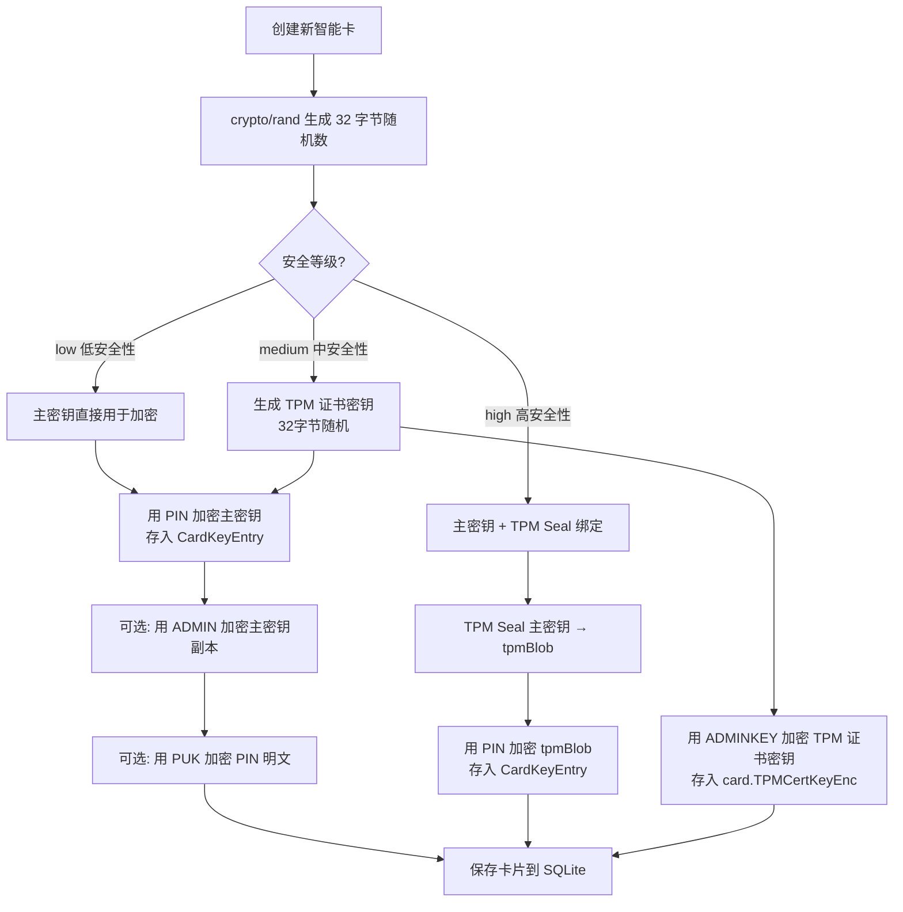
```mermaid
flowchart TD
    A[创建新智能卡] --> B[crypto/rand 生成 32 字节随机数]
    B --> C{安全等级?}
    
    C -->|low 低安全性| D[主密钥直接用于加密]
    C -->|medium 中安全性| E[生成 TPM 证书密钥<br/>32字节随机]
    C -->|high 高安全性| F[主密钥 + TPM Seal 绑定]
    
    D --> G[用 PIN 加密主密钥<br/>存入 CardKeyEntry]
    E --> H[用 ADMINKEY 加密 TPM 证书密钥<br/>存入 card.TPMCertKeyEnc]
    E --> G
    F --> I[TPM Seal 主密钥 → tpmBlob]
    I --> J[用 PIN 加密 tpmBlob<br/>存入 CardKeyEntry]
    
    G --> K[可选: 用 ADMIN 加密主密钥副本]
    K --> L[可选: 用 PUK 加密 PIN 明文]
    L --> M[保存卡片到 SQLite]
    
    J --> M
    H --> M
```

### 2.2 主密钥加密存储格式

```
┌─────────────────────────────────────────────────────────────┐
│                    CardKeyEntry (JSON BLOB)                   │
├─────────────────────────────────────────────────────────────┤
│  key_type: "pin" | "card" | "admin" | "user"                │
│  user_uuid: "" (仅 user 类型有效)                            │
│  salt: [32 字节随机盐值]                                     │
│  enc_master_key: [nonce(12B) + 密文 + tag(16B)]             │
│  attempts: 0 (失败次数)                                      │
│  locked: false                                               │
├─────────────────────────────────────────────────────────────┤
│  加密算法:                                                    │
│    AES密钥 = HMAC-SHA256(凭据明文, salt)                     │
│    enc_master_key = AES-256-GCM(AES密钥, 主密钥明文)         │
└─────────────────────────────────────────────────────────────┘
```

### 2.3 主密钥加密流程（encryptMasterKey）

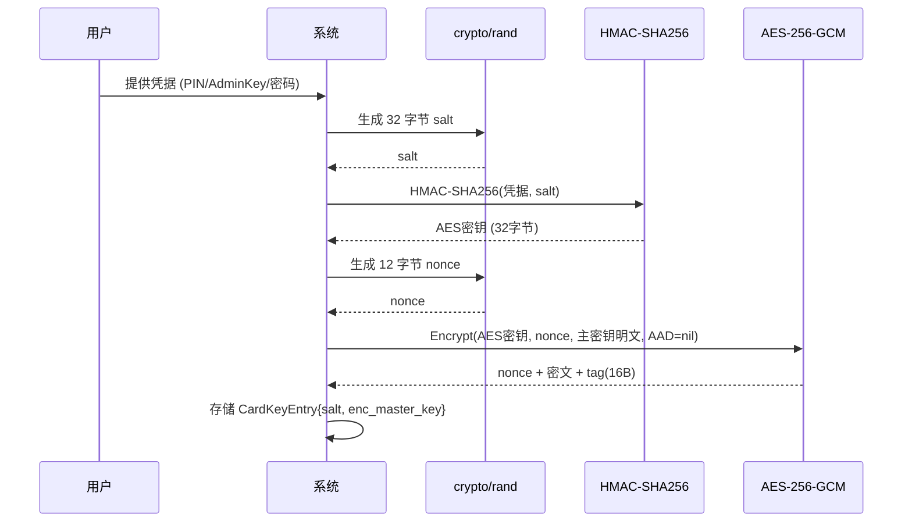
```mermaid
sequenceDiagram
    participant User as 用户
    participant Sys as 系统
    participant CSPRNG as crypto/rand
    participant HMAC as HMAC-SHA256
    participant AES as AES-256-GCM

    User->>Sys: 提供凭据 (PIN/AdminKey/密码)
    Sys->>CSPRNG: 生成 32 字节 salt
    CSPRNG-->>Sys: salt
    Sys->>HMAC: HMAC-SHA256(凭据, salt)
    HMAC-->>Sys: AES密钥 (32字节)
    Sys->>CSPRNG: 生成 12 字节 nonce
    CSPRNG-->>Sys: nonce
    Sys->>AES: Encrypt(AES密钥, nonce, 主密钥明文, AAD=nil)
    AES-->>Sys: nonce + 密文 + tag(16B)
    Sys->>Sys: 存储 CardKeyEntry{salt, enc_master_key}
```

### 2.4 主密钥解密流程（unlockMasterKey）

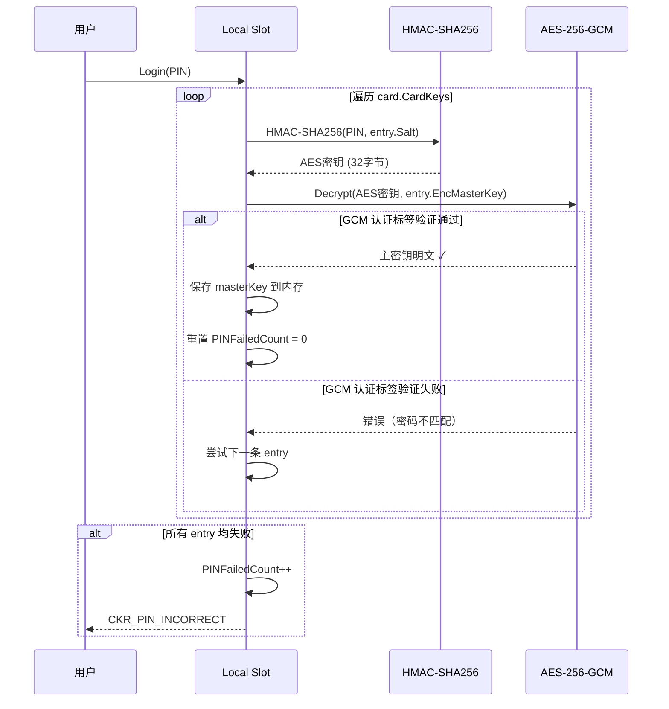
```mermaid
sequenceDiagram
    participant User as 用户
    participant Slot as Local Slot
    participant HMAC as HMAC-SHA256
    participant AES as AES-256-GCM

    User->>Slot: Login(PIN)
    
    loop 遍历 card.CardKeys
        Slot->>HMAC: HMAC-SHA256(PIN, entry.Salt)
        HMAC-->>Slot: AES密钥 (32字节)
        Slot->>AES: Decrypt(AES密钥, entry.EncMasterKey)
        alt GCM 认证标签验证通过
            AES-->>Slot: 主密钥明文 ✓
            Slot->>Slot: 保存 masterKey 到内存
            Slot->>Slot: 重置 PINFailedCount = 0
        else GCM 认证标签验证失败
            AES-->>Slot: 错误（密码不匹配）
            Slot->>Slot: 尝试下一条 entry
        end
    end
    
    alt 所有 entry 均失败
        Slot->>Slot: PINFailedCount++
        Slot-->>User: CKR_PIN_INCORRECT
    end
```

---

## 三、PIN / PUK / Admin Key 三级凭据

### 3.1 凭据关系图

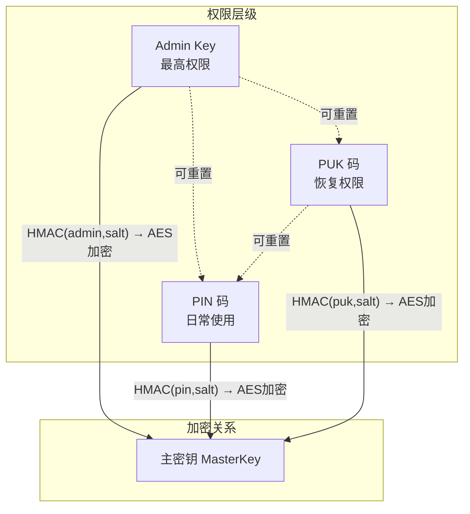
```mermaid
graph TD
    subgraph 权限层级
        ADMIN_KEY[Admin Key<br/>最高权限]
        PUK_KEY[PUK 码<br/>恢复权限]
        PIN_KEY[PIN 码<br/>日常使用]
    end

    subgraph 加密关系
        MK[主密钥 MasterKey]
    end

    ADMIN_KEY -->|"HMAC(admin,salt) → AES加密"| MK
    PIN_KEY -->|"HMAC(pin,salt) → AES加密"| MK
    PUK_KEY -->|"HMAC(puk,salt) → AES加密"| MK

    ADMIN_KEY -.->|可重置| PUK_KEY
    ADMIN_KEY -.->|可重置| PIN_KEY
    PUK_KEY -.->|可重置| PIN_KEY
```

### 3.2 PIN 加密存储流程

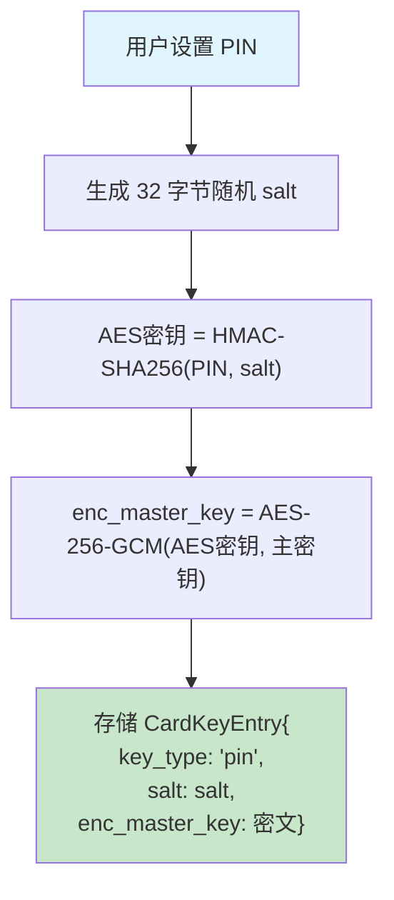
```mermaid
flowchart TD
    A[用户设置 PIN] --> B[生成 32 字节随机 salt]
    B --> C["AES密钥 = HMAC-SHA256(PIN, salt)"]
    C --> D["enc_master_key = AES-256-GCM(AES密钥, 主密钥)"]
    D --> E["存储 CardKeyEntry{<br/>key_type: 'pin',<br/>salt: salt,<br/>enc_master_key: 密文}"]
    
    style A fill:#e1f5fe
    style E fill:#c8e6c9
```

### 3.3 PUK 加密存储流程（直接加密主密钥，与 PIN/Admin 统一）

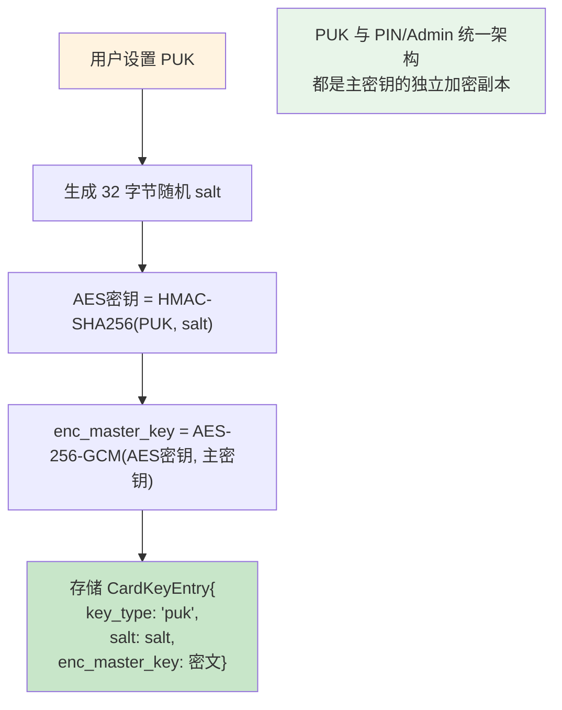
```mermaid
flowchart TD
    A[用户设置 PUK] --> B[生成 32 字节随机 salt]
    B --> C["AES密钥 = HMAC-SHA256(PUK, salt)"]
    C --> D["enc_master_key = AES-256-GCM(AES密钥, 主密钥)"]
    D --> E["存储 CardKeyEntry{<br/>key_type: 'puk',<br/>salt: salt,<br/>enc_master_key: 密文}"]
    
    F[PUK 与 PIN/Admin 统一架构<br/>都是主密钥的独立加密副本]
    
    style A fill:#fff3e0
    style E fill:#c8e6c9
    style F fill:#e8f5e9
```

### 3.4 Admin Key 加密存储流程

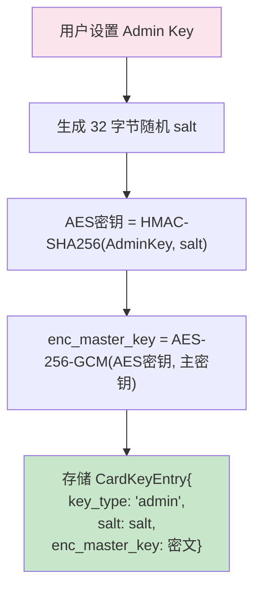
```mermaid
flowchart TD
    A[用户设置 Admin Key] --> B[生成 32 字节随机 salt]
    B --> C["AES密钥 = HMAC-SHA256(AdminKey, salt)"]
    C --> D["enc_master_key = AES-256-GCM(AES密钥, 主密钥)"]
    D --> E["存储 CardKeyEntry{<br/>key_type: 'admin',<br/>salt: salt,<br/>enc_master_key: 密文}"]
    
    style A fill:#fce4ec
    style E fill:#c8e6c9
```

### 3.5 PUK 重置 PIN 流程

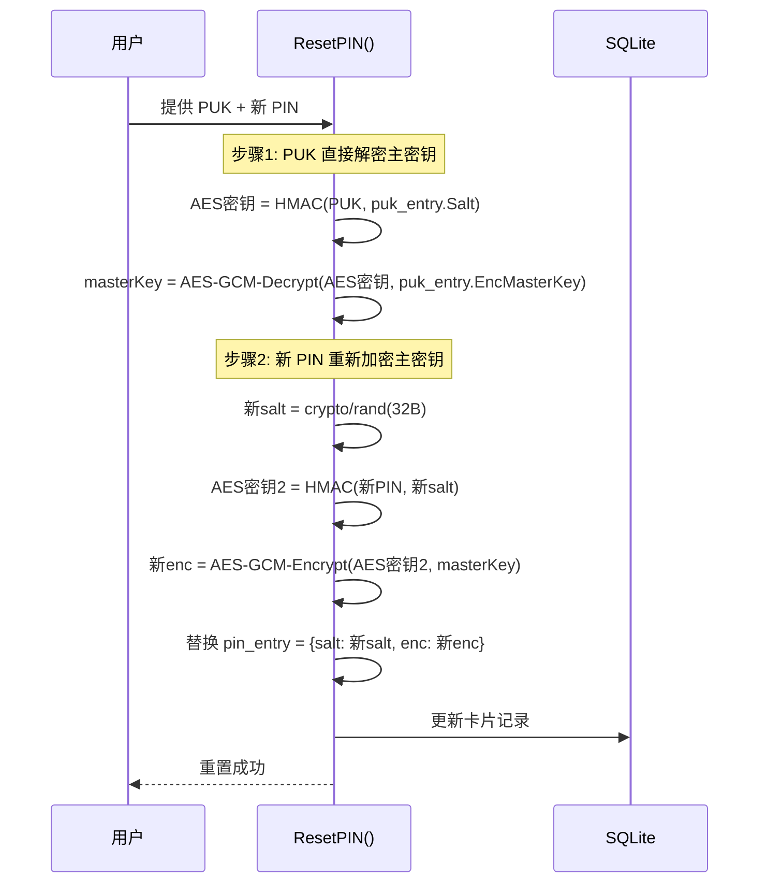
```mermaid
sequenceDiagram
    participant User as 用户
    participant Sys as ResetPIN()
    participant DB as SQLite

    User->>Sys: 提供 PUK + 新 PIN
    
    Note over Sys: 步骤1: PUK 直接解密主密钥
    Sys->>Sys: AES密钥 = HMAC(PUK, puk_entry.Salt)
    Sys->>Sys: masterKey = AES-GCM-Decrypt(AES密钥, puk_entry.EncMasterKey)
    
    Note over Sys: 步骤2: 新 PIN 重新加密主密钥
    Sys->>Sys: 新salt = crypto/rand(32B)
    Sys->>Sys: AES密钥2 = HMAC(新PIN, 新salt)
    Sys->>Sys: 新enc = AES-GCM-Encrypt(AES密钥2, masterKey)
    Sys->>Sys: 替换 pin_entry = {salt: 新salt, enc: 新enc}
    
    Sys->>DB: 更新卡片记录
    Sys-->>User: 重置成功
```

### 3.6 Admin Key 重置 PIN 流程

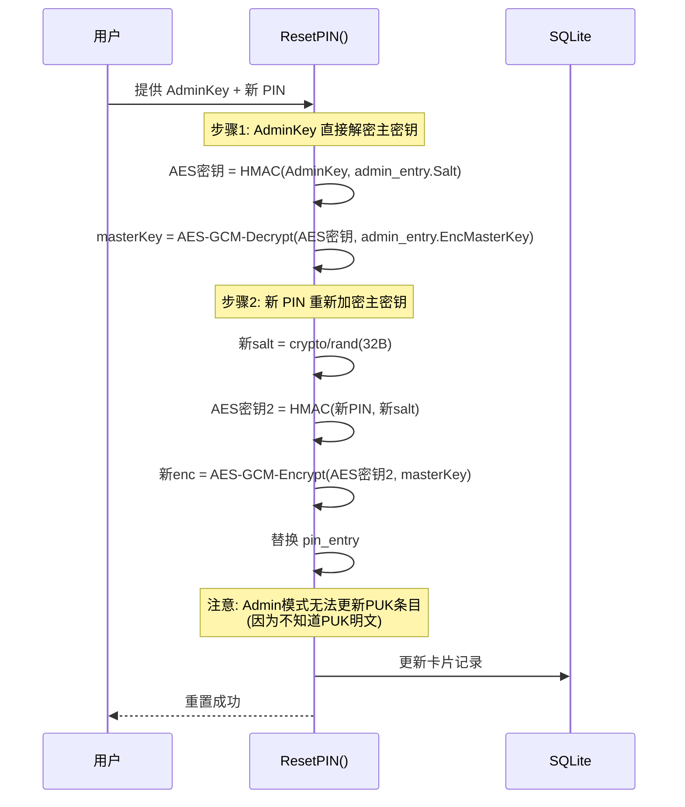
```mermaid
sequenceDiagram
    participant User as 用户
    participant Sys as ResetPIN()
    participant DB as SQLite

    User->>Sys: 提供 AdminKey + 新 PIN
    
    Note over Sys: 步骤1: AdminKey 直接解密主密钥
    Sys->>Sys: AES密钥 = HMAC(AdminKey, admin_entry.Salt)
    Sys->>Sys: masterKey = AES-GCM-Decrypt(AES密钥, admin_entry.EncMasterKey)
    
    Note over Sys: 步骤2: 新 PIN 重新加密主密钥
    Sys->>Sys: 新salt = crypto/rand(32B)
    Sys->>Sys: AES密钥2 = HMAC(新PIN, 新salt)
    Sys->>Sys: 新enc = AES-GCM-Encrypt(AES密钥2, masterKey)
    Sys->>Sys: 替换 pin_entry
    
    Note over Sys: 注意: Admin模式无法更新PUK条目<br/>(因为不知道PUK明文)
    
    Sys->>DB: 更新卡片记录
    Sys-->>User: 重置成功
```

### 3.7 错误次数与锁定机制

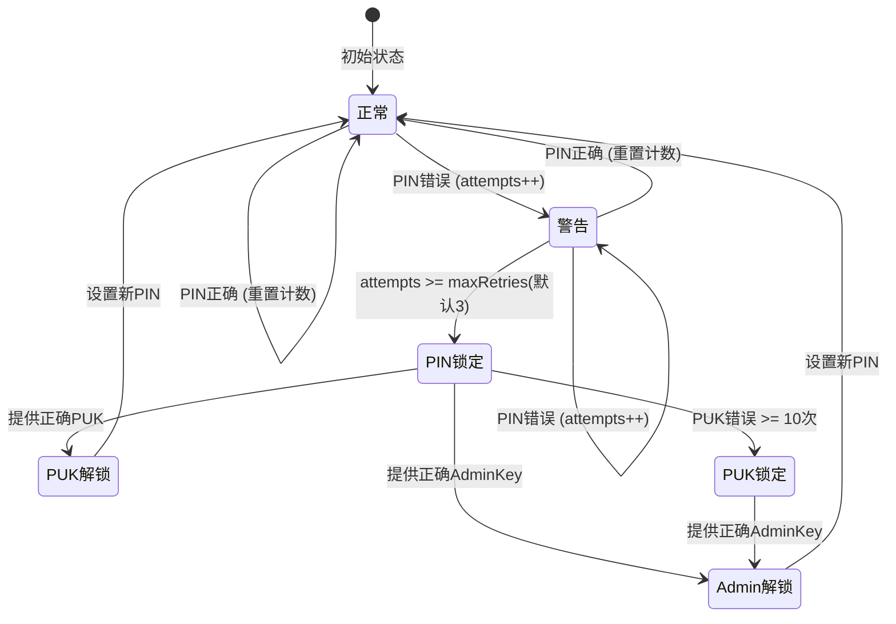
```mermaid
stateDiagram-v2
    [*] --> 正常: 初始状态
    正常 --> 正常: PIN正确 (重置计数)
    正常 --> 警告: PIN错误 (attempts++)
    警告 --> 警告: PIN错误 (attempts++)
    警告 --> 正常: PIN正确 (重置计数)
    警告 --> PIN锁定: attempts >= maxRetries(默认3)
    
    PIN锁定 --> PUK解锁: 提供正确PUK
    PIN锁定 --> Admin解锁: 提供正确AdminKey
    PUK解锁 --> 正常: 设置新PIN
    Admin解锁 --> 正常: 设置新PIN
    
    PIN锁定 --> PUK锁定: PUK错误 >= 10次
    PUK锁定 --> Admin解锁: 提供正确AdminKey
```

---

## 四、证书密钥（临时密钥 + 私钥）

### 4.1 证书密钥生成与加密存储流程（低安全性）

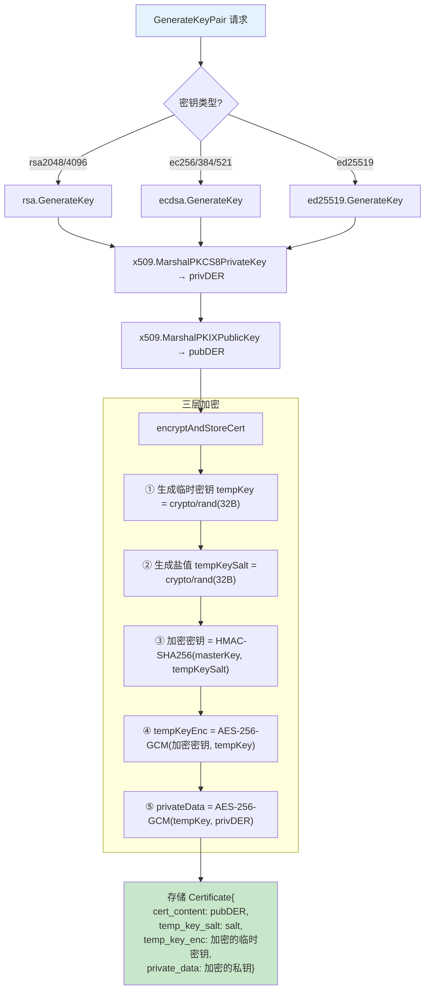
```mermaid
flowchart TD
    A[GenerateKeyPair 请求] --> B{密钥类型?}
    B -->|rsa2048/4096| C[rsa.GenerateKey]
    B -->|ec256/384/521| D[ecdsa.GenerateKey]
    B -->|ed25519| E[ed25519.GenerateKey]
    
    C --> F[x509.MarshalPKCS8PrivateKey → privDER]
    D --> F
    E --> F
    F --> G[x509.MarshalPKIXPublicKey → pubDER]
    
    G --> H[encryptAndStoreCert]
    
    subgraph 三层加密
        H --> I["① 生成临时密钥 tempKey = crypto/rand(32B)"]
        I --> J["② 生成盐值 tempKeySalt = crypto/rand(32B)"]
        J --> K["③ 加密密钥 = HMAC-SHA256(masterKey, tempKeySalt)"]
        K --> L["④ tempKeyEnc = AES-256-GCM(加密密钥, tempKey)"]
        L --> M["⑤ privateData = AES-256-GCM(tempKey, privDER)"]
    end
    
    M --> N["存储 Certificate{<br/>cert_content: pubDER,<br/>temp_key_salt: salt,<br/>temp_key_enc: 加密的临时密钥,<br/>private_data: 加密的私钥}"]
    
    style A fill:#e3f2fd
    style N fill:#c8e6c9
```

### 4.2 证书私钥解密流程

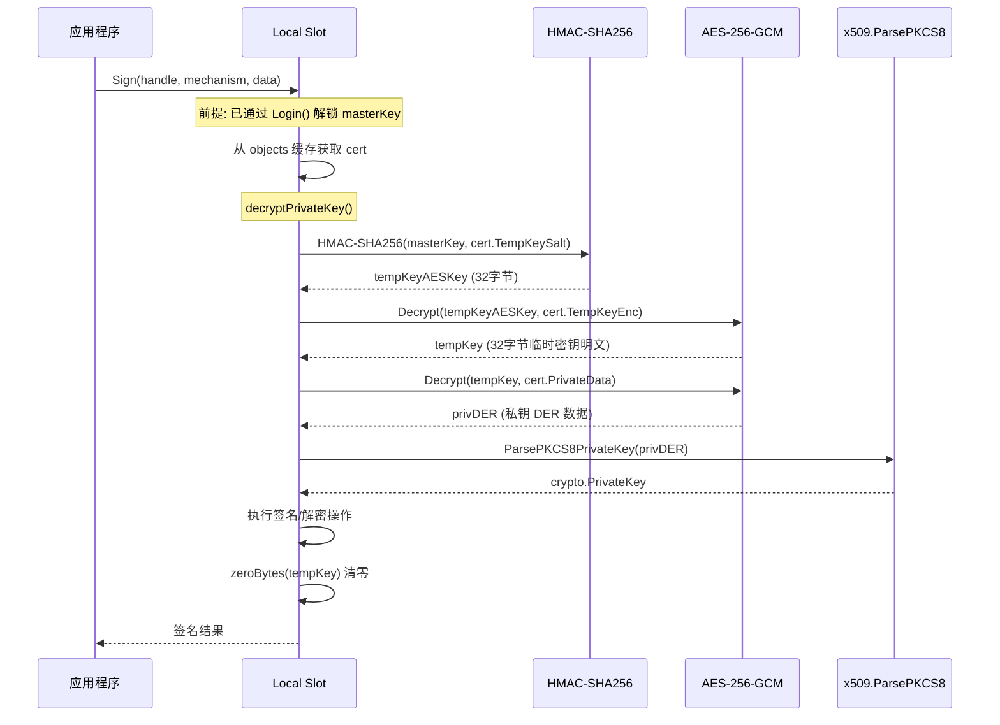
```mermaid
sequenceDiagram
    participant App as 应用程序
    participant Slot as Local Slot
    participant HMAC as HMAC-SHA256
    participant AES as AES-256-GCM
    participant X509 as x509.ParsePKCS8

    App->>Slot: Sign(handle, mechanism, data)
    
    Note over Slot: 前提: 已通过 Login() 解锁 masterKey
    
    Slot->>Slot: 从 objects 缓存获取 cert
    
    Note over Slot: decryptPrivateKey()
    Slot->>HMAC: HMAC-SHA256(masterKey, cert.TempKeySalt)
    HMAC-->>Slot: tempKeyAESKey (32字节)
    
    Slot->>AES: Decrypt(tempKeyAESKey, cert.TempKeyEnc)
    AES-->>Slot: tempKey (32字节临时密钥明文)
    
    Slot->>AES: Decrypt(tempKey, cert.PrivateData)
    AES-->>Slot: privDER (私钥 DER 数据)
    
    Slot->>X509: ParsePKCS8PrivateKey(privDER)
    X509-->>Slot: crypto.PrivateKey
    
    Slot->>Slot: 执行签名/解密操作
    Slot->>Slot: zeroBytes(tempKey) 清零
    Slot-->>App: 签名结果
```

### 4.3 证书密钥存储数据结构

```
┌─────────────────────────────────────────────────────────────────┐
│                    Certificate (SQLite 表)                        │
├─────────────────────────────────────────────────────────────────┤
│  uuid:          "550e8400-e29b-..."                              │
│  slot_type:     "local"                                          │
│  card_uuid:     "卡片UUID"                                       │
│  cert_type:     "x509" | "ssh" | "gpg" | "totp" | ...          │
│  key_type:      "rsa2048" | "ec256" | "ed25519" | ...           │
│  cert_content:  [公钥 DER / 证书 DER / 公开元数据]               │
│                                                                  │
│  ┌── 加密字段（不序列化到 JSON）──────────────────────────────┐  │
│  │  temp_key_salt:   [32 字节随机盐值]                        │  │
│  │  temp_key_enc:    [nonce(12B) + 加密的临时密钥 + tag(16B)] │  │
│  │  private_data:    [nonce(12B) + 加密的私钥DER + tag(16B)]  │  │
│  └────────────────────────────────────────────────────────────┘  │
│                                                                  │
│  ┌── TPM 专用字段 ───────────────────────────────────────────┐  │
│  │  tpm_platform:    "tpm2" | "medium" | ""                   │  │
│  │  tpm_private_blob: [TPM Seal 后的密钥 blob]                │  │
│  │  tpm_auth_policy:  [TPM 证书密钥盐值引用]                  │  │
│  └────────────────────────────────────────────────────────────┘  │
└─────────────────────────────────────────────────────────────────┘
```

---

## 五、三级安全模式完整流程

### 5.1 低安全性模式（SecurityLevelLow）

```mermaid
flowchart TD
    subgraph 创建卡片
        A1[生成 masterKey = rand(32B)] --> A2["PIN加密: HMAC(PIN,salt) → AES(masterKey)"]
        A2 --> A3["Admin加密: HMAC(Admin,salt) → AES(masterKey)"]
        A3 --> A4["PUK加密: HMAC(PUK,salt) → AES(masterKey)"]
    end
    
    subgraph 生成证书密钥
        B1["生成 tempKey = rand(32B)"] --> B2["HMAC(masterKey, salt) → AES密钥"]
        B2 --> B3["AES(AES密钥, tempKey) → tempKeyEnc"]
        B3 --> B4["AES(tempKey, privDER) → privateData"]
    end
    
    subgraph 使用私钥
        C1["PIN → 解密 masterKey"] --> C2["HMAC(masterKey, salt) → 解密 tempKey"]
        C2 --> C3["tempKey → 解密 privDER"]
        C3 --> C4["签名/解密操作"]
        C4 --> C5["zeroBytes 清零"]
    end
    
    A4 --> B1
    B4 --> C1
```

### 5.2 中安全性模式（SecurityLevelMedium）

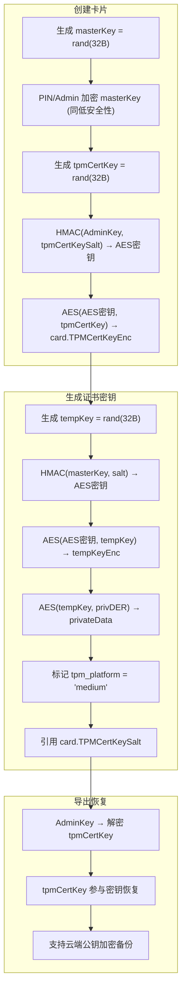
```mermaid
flowchart TD
    subgraph 创建卡片
        A1["生成 masterKey = rand(32B)"] --> A2["PIN/Admin 加密 masterKey (同低安全性)"]
        A2 --> A3["生成 tpmCertKey = rand(32B)"]
        A3 --> A4["HMAC(AdminKey, tpmCertKeySalt) → AES密钥"]
        A4 --> A5["AES(AES密钥, tpmCertKey) → card.TPMCertKeyEnc"]
    end
    
    subgraph 生成证书密钥
        B1["生成 tempKey = rand(32B)"] --> B2["HMAC(masterKey, salt) → AES密钥"]
        B2 --> B3["AES(AES密钥, tempKey) → tempKeyEnc"]
        B3 --> B4["AES(tempKey, privDER) → privateData"]
        B4 --> B5["标记 tpm_platform = 'medium'"]
        B5 --> B6["引用 card.TPMCertKeySalt"]
    end
    
    subgraph 导出恢复
        C1["AdminKey → 解密 tpmCertKey"] --> C2["tpmCertKey 参与密钥恢复"]
        C2 --> C3["支持云端公钥加密备份"]
    end
    
    A5 --> B1
    B6 --> C1
```

### 5.3 高安全性模式（SecurityLevelHigh）— TPM2 Slot

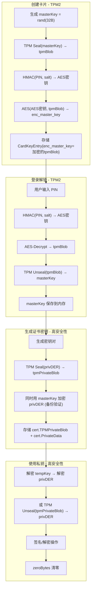
```mermaid
flowchart TD
    subgraph 创建卡片 - TPM2
        A1["生成 masterKey = rand(32B)"] --> A2["TPM Seal(masterKey) → tpmBlob"]
        A2 --> A3["HMAC(PIN, salt) → AES密钥"]
        A3 --> A4["AES(AES密钥, tpmBlob) → enc_master_key"]
        A4 --> A5["存储 CardKeyEntry{enc_master_key=加密的tpmBlob}"]
    end
    
    subgraph 登录解锁 - TPM2
        B1["用户输入 PIN"] --> B2["HMAC(PIN, salt) → AES密钥"]
        B2 --> B3["AES-Decrypt → tpmBlob"]
        B3 --> B4["TPM Unseal(tpmBlob) → masterKey"]
        B4 --> B5["masterKey 保存到内存"]
    end
    
    subgraph 生成证书密钥 - 高安全性
        C1["生成密钥对"] --> C2["TPM Seal(privDER) → tpmPrivateBlob"]
        C2 --> C3["同时用 masterKey 加密 privDER (备份验证)"]
        C3 --> C4["存储 cert.TPMPrivateBlob + cert.PrivateData"]
    end
    
    subgraph 使用私钥 - 高安全性
        D1["解密 tempKey → 解密 privDER"] --> D2["或 TPM Unseal(tpmPrivateBlob) → privDER"]
        D2 --> D3["签名/解密操作"]
        D3 --> D4["zeroBytes 清零"]
    end
    
    A5 --> B1
    B5 --> C1
    C4 --> D1
```

---

## 六、完整签名操作端到端流程

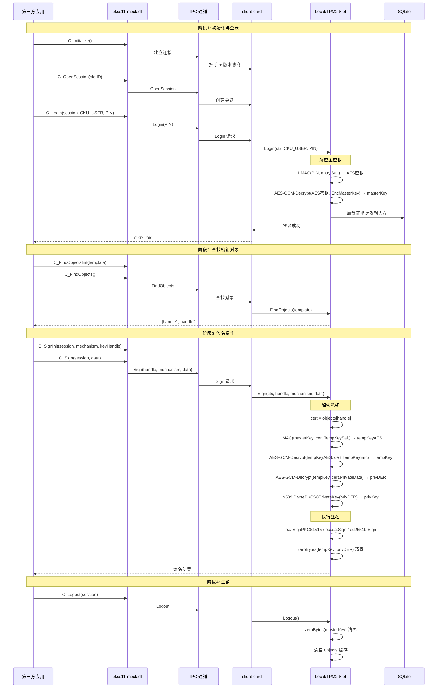
```mermaid
sequenceDiagram
    participant App as 第三方应用
    participant DRV as pkcs11-mock.dll
    participant IPC as IPC 通道
    participant Client as client-card
    participant Slot as Local/TPM2 Slot
    participant DB as SQLite

    Note over App,DB: 阶段1: 初始化与登录
    App->>DRV: C_Initialize()
    DRV->>IPC: 建立连接
    IPC->>Client: 握手 + 版本协商
    
    App->>DRV: C_OpenSession(slotID)
    DRV->>IPC: OpenSession
    IPC->>Client: 创建会话
    
    App->>DRV: C_Login(session, CKU_USER, PIN)
    DRV->>IPC: Login(PIN)
    IPC->>Client: Login 请求
    Client->>Slot: Login(ctx, CKU_USER, PIN)
    
    Note over Slot: 解密主密钥
    Slot->>Slot: HMAC(PIN, entry.Salt) → AES密钥
    Slot->>Slot: AES-GCM-Decrypt(AES密钥, EncMasterKey) → masterKey
    Slot->>DB: 加载证书对象到内存
    Slot-->>Client: 登录成功
    Client-->>App: CKR_OK

    Note over App,DB: 阶段2: 查找密钥对象
    App->>DRV: C_FindObjectsInit(template)
    App->>DRV: C_FindObjects()
    DRV->>IPC: FindObjects
    IPC->>Client: 查找对象
    Client->>Slot: FindObjects(template)
    Slot-->>App: [handle1, handle2, ...]

    Note over App,DB: 阶段3: 签名操作
    App->>DRV: C_SignInit(session, mechanism, keyHandle)
    App->>DRV: C_Sign(session, data)
    DRV->>IPC: Sign(handle, mechanism, data)
    IPC->>Client: Sign 请求
    Client->>Slot: Sign(ctx, handle, mechanism, data)
    
    Note over Slot: 解密私钥
    Slot->>Slot: cert = objects[handle]
    Slot->>Slot: HMAC(masterKey, cert.TempKeySalt) → tempKeyAES
    Slot->>Slot: AES-GCM-Decrypt(tempKeyAES, cert.TempKeyEnc) → tempKey
    Slot->>Slot: AES-GCM-Decrypt(tempKey, cert.PrivateData) → privDER
    Slot->>Slot: x509.ParsePKCS8PrivateKey(privDER) → privKey
    
    Note over Slot: 执行签名
    Slot->>Slot: rsa.SignPKCS1v15 / ecdsa.Sign / ed25519.Sign
    Slot->>Slot: zeroBytes(tempKey, privDER) 清零
    
    Slot-->>App: 签名结果

    Note over App,DB: 阶段4: 注销
    App->>DRV: C_Logout(session)
    DRV->>IPC: Logout
    Client->>Slot: Logout()
    Slot->>Slot: zeroBytes(masterKey) 清零
    Slot->>Slot: 清空 objects 缓存
```

---

## 七、通用安全凭据加密流程（TOTP/FIDO/Login/Note/Payment）

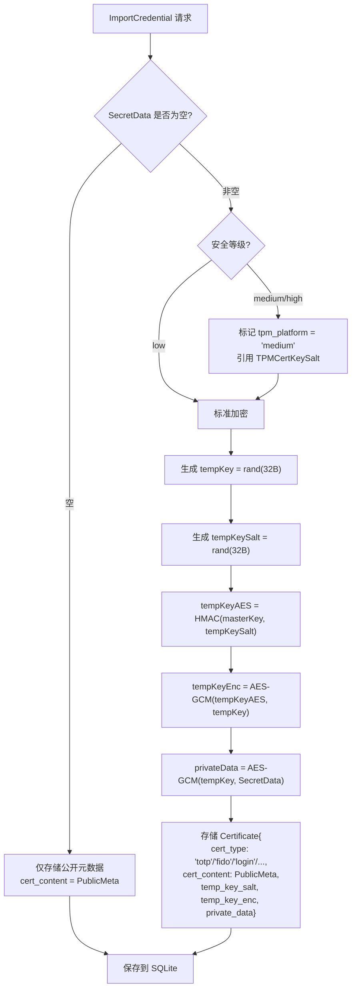
```mermaid
flowchart TD
    A[ImportCredential 请求] --> B{SecretData 是否为空?}
    
    B -->|空| C[仅存储公开元数据<br/>cert_content = PublicMeta]
    
    B -->|非空| D{安全等级?}
    D -->|medium/high| E["标记 tpm_platform = 'medium'<br/>引用 TPMCertKeySalt"]
    D -->|low| F[标准加密]
    
    E --> F
    F --> G["生成 tempKey = rand(32B)"]
    G --> H["生成 tempKeySalt = rand(32B)"]
    H --> I["tempKeyAES = HMAC(masterKey, tempKeySalt)"]
    I --> J["tempKeyEnc = AES-GCM(tempKeyAES, tempKey)"]
    J --> K["privateData = AES-GCM(tempKey, SecretData)"]
    K --> L["存储 Certificate{<br/>cert_type: 'totp'/'fido'/'login'/...,<br/>cert_content: PublicMeta,<br/>temp_key_salt, temp_key_enc, private_data}"]
    
    C --> M[保存到 SQLite]
    L --> M
```

---

## 八、密码修改时的密钥轮换流程

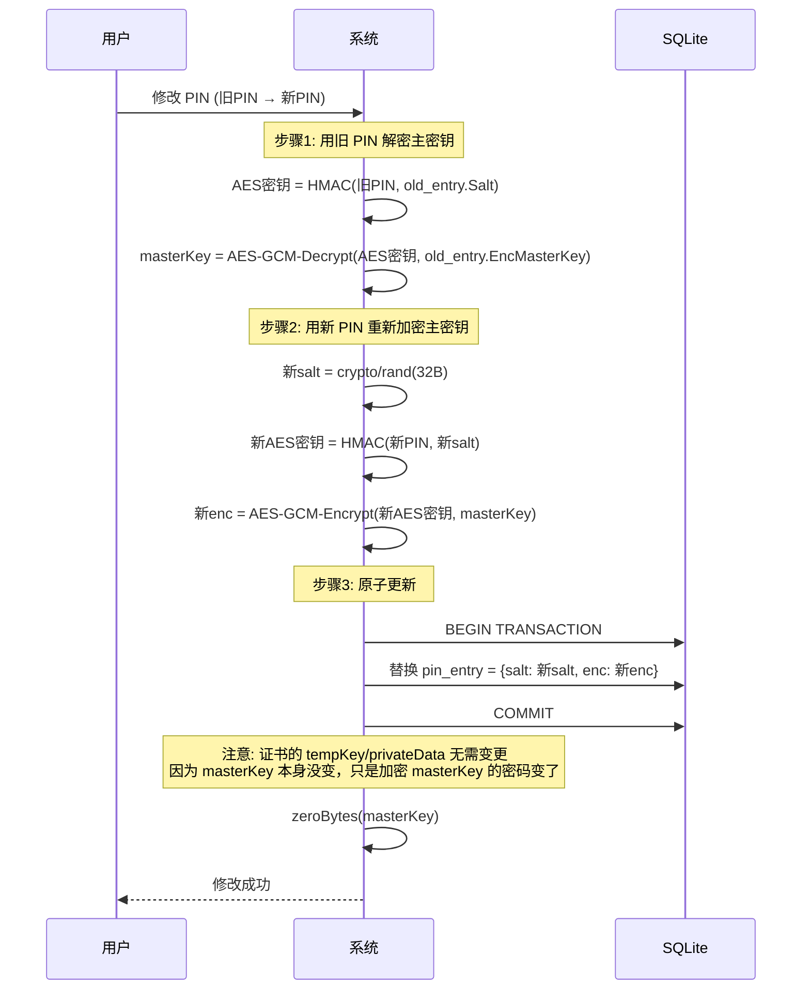
```mermaid
sequenceDiagram
    participant User as 用户
    participant Sys as 系统
    participant DB as SQLite

    User->>Sys: 修改 PIN (旧PIN → 新PIN)
    
    Note over Sys: 步骤1: 用旧 PIN 解密主密钥
    Sys->>Sys: AES密钥 = HMAC(旧PIN, old_entry.Salt)
    Sys->>Sys: masterKey = AES-GCM-Decrypt(AES密钥, old_entry.EncMasterKey)
    
    Note over Sys: 步骤2: 用新 PIN 重新加密主密钥
    Sys->>Sys: 新salt = crypto/rand(32B)
    Sys->>Sys: 新AES密钥 = HMAC(新PIN, 新salt)
    Sys->>Sys: 新enc = AES-GCM-Encrypt(新AES密钥, masterKey)
    
    Note over Sys: 步骤3: 原子更新
    Sys->>DB: BEGIN TRANSACTION
    Sys->>DB: 替换 pin_entry = {salt: 新salt, enc: 新enc}
    Sys->>DB: COMMIT
    
    Note over Sys: 注意: 证书的 tempKey/privateData 无需变更<br/>因为 masterKey 本身没变，只是加密 masterKey 的密码变了
    
    Sys->>Sys: zeroBytes(masterKey)
    Sys-->>User: 修改成功
```

---

## 九、加密参数汇总表

| 组件 | 算法 | 密钥长度 | Nonce | Tag | 盐值 | 备注 |
|------|------|---------|-------|-----|------|------|
| 主密钥加密(PIN/PUK/Admin) | AES-256-GCM | 32B | 12B | 16B | 32B | 密钥=HMAC(凭据,salt) |
| 临时密钥加密 | AES-256-GCM | 32B | 12B | 16B | 32B | 密钥=HMAC(masterKey,salt) |
| 私钥加密 | AES-256-GCM | 32B | 12B | 16B | — | 密钥=tempKey |
| TPM证书密钥加密 | AES-256-GCM | 32B | 12B | 16B | 32B | 密钥=HMAC(AdminKey,salt) |
| 密钥派生(新) | Argon2id | 32B输出 | — | — | 32B | time=3,mem=64MB,threads=4 |
| 密钥派生(旧) | HMAC-SHA256 | 32B输出 | — | — | 32B | 向后兼容 |
| TPM Seal | 平台相关 | — | — | — | — | 绑定到设备 PCR |
| 随机数生成 | crypto/rand | — | — | — | — | CSPRNG |

---

## 十、安全设计要点

### 10.1 为什么 PUK 直接加密主密钥（与 PIN/Admin 统一）？

```
设计决策：PUK/PIN/Admin 三级凭据都独立加密主密钥副本

原因：
1. 统一架构：PIN/PUK/Admin 均为 AES-GCM(HMAC(凭据,salt), masterKey)
2. 修改 PIN 时不需要知道 PUK（PIN 解密主密钥 → 新 PIN 加密主密钥）
3. PUK 重置 PIN 只需一步（PUK 解密主密钥 → 新 PIN 加密主密钥）
4. Admin 重置 PIN/PUK 只需一步（Admin 解密主密钥 → 新凭据加密主密钥）
5. 避免旧架构中"PUK 加密 PIN"导致的循环依赖问题：
   修改 PIN 时不知道 PUK，无法同步更新 PUK 加密的 PIN 副本
```

### 10.2 为什么每个证书有独立的临时密钥？

```
设计决策：每个 Certificate 有独立的 tempKey + tempKeySalt

原因：
1. 单个证书泄露不影响其他证书
2. 删除证书时只需清除该证书的加密数据
3. 不同证书可以有不同的 AAD 绑定
4. 支持细粒度的密钥轮换
```

### 10.3 GCM 认证标签作为密码验证机制

```
设计决策：不单独存储密码哈希，而是通过 GCM 解密成功/失败来验证

原因：
1. GCM 的 16 字节认证标签本身就是密码正确性的证明
2. 解密失败 = 密码错误（标签验证失败）
3. 减少了存储的数据量（不需要额外的哈希字段）
4. 满足"加密存储"而非"仅验证"的安全要求
```

### 10.4 内存安全

```
所有密钥使用后立即清零：
- defer zeroBytes(masterKey)
- defer zeroBytes(tempKey)
- 使用 for range 逐字节置零
- Logout 时清零 slot.masterKey
```

---

## 十一、数据库存储布局

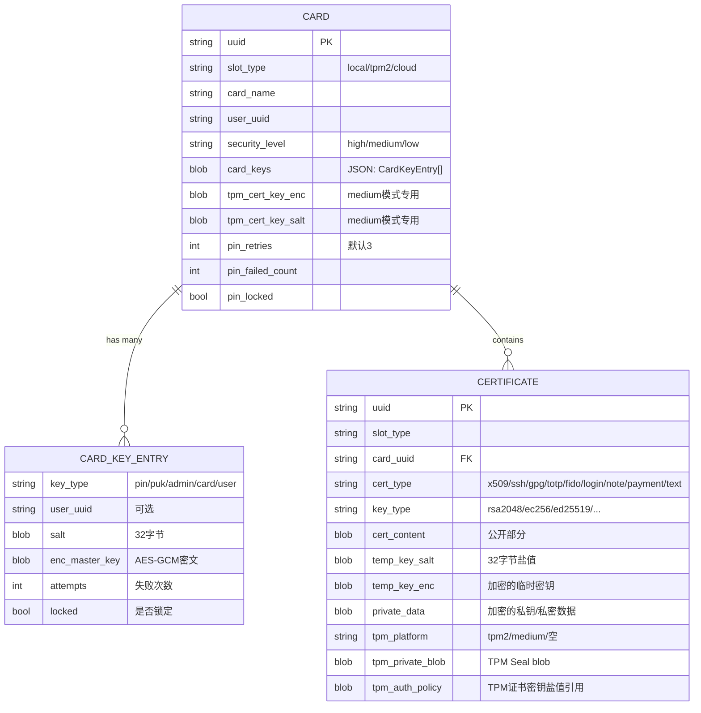
```mermaid
erDiagram
    CARD ||--o{ CARD_KEY_ENTRY : "has many"
    CARD ||--o{ CERTIFICATE : "contains"
    
    CARD {
        string uuid PK
        string slot_type "local/tpm2/cloud"
        string card_name
        string user_uuid
        string security_level "high/medium/low"
        blob card_keys "JSON: CardKeyEntry[]"
        blob tpm_cert_key_enc "medium模式专用"
        blob tpm_cert_key_salt "medium模式专用"
        int pin_retries "默认3"
        int pin_failed_count
        bool pin_locked
    }
    
    CARD_KEY_ENTRY {
        string key_type "pin/puk/admin/card/user"
        string user_uuid "可选"
        blob salt "32字节"
        blob enc_master_key "AES-GCM密文"
        int attempts "失败次数"
        bool locked "是否锁定"
    }
    
    CERTIFICATE {
        string uuid PK
        string slot_type
        string card_uuid FK
        string cert_type "x509/ssh/gpg/totp/fido/login/note/payment/text"
        string key_type "rsa2048/ec256/ed25519/..."
        blob cert_content "公开部分"
        blob temp_key_salt "32字节盐值"
        blob temp_key_enc "加密的临时密钥"
        blob private_data "加密的私钥/私密数据"
        string tpm_platform "tpm2/medium/空"
        blob tpm_private_blob "TPM Seal blob"
        blob tpm_auth_policy "TPM证书密钥盐值引用"
    }
```

---

## 十二、代码文件对照表

| 流程 | 代码文件 | 关键函数 |
|------|---------|---------|
| 主密钥生成 | `card/local/keymgr.go` | `CreateCardWithCreds()` |
| 主密钥加密 | `card/local/keymgr.go` | `encryptMasterKey()` |
| 主密钥解密 | `card/local/slot.go` | `unlockMasterKey()` |
| 主密钥解密(指定类型) | `card/local/keymgr.go` | `tryUnlockByType()` |
| PIN重置(PUK/Admin) | `card/local/keymgr.go` | `ResetPIN()` |
| PUK重置(Admin) | `card/local/keymgr.go` | `ResetPUK()` |
| 证书密钥生成+加密 | `card/local/keymgr.go` | `encryptAndStoreCert()` |
| 证书密钥解密 | `card/local/slot.go` | `decryptPrivateKey()` |
| 签名操作 | `card/local/slot.go` | `Sign()` |
| 解密操作 | `card/local/slot.go` | `Decrypt()` |
| TPM2 主密钥加密 | `card/tpm2/keymgr.go` | `encryptTPMBlob()` |
| TPM2 主密钥解密 | `card/tpm2/slot.go` | `unlockMasterKey()` |
| TPM2 高安全性存储 | `card/local/keymgr.go` | `encryptAndStoreCertWithTPM()` |
| TPM2 中安全性存储 | `card/local/keymgr.go` | `encryptAndStoreCertWithTPMCertKey()` |
| TPM证书密钥解密 | `card/local/keymgr.go` | `DecryptTPMCertKey()` |
| 通用凭据加密 | `card/local/keymgr.go` | `ImportCredential()` |
| AES-256-GCM | `crypto/aes.go` | `EncryptAES256GCM()` / `DecryptAES256GCM()` |
| HMAC-SHA256 | `crypto/hmac.go` | `HMACSHA256()` |
| Argon2id | `crypto/argon2.go` | `DeriveKeyArgon2id()` |
| 密钥对生成 | `card/local/keymgr.go` | `generateKeyPair()` |
| 失败计数 | `card/local/keymgr.go` | `bumpFailure()` |
| 登录(Local) | `card/local/slot.go` | `Login()` |
| 登录(TPM2) | `card/tpm2/slot.go` | `Login()` |
